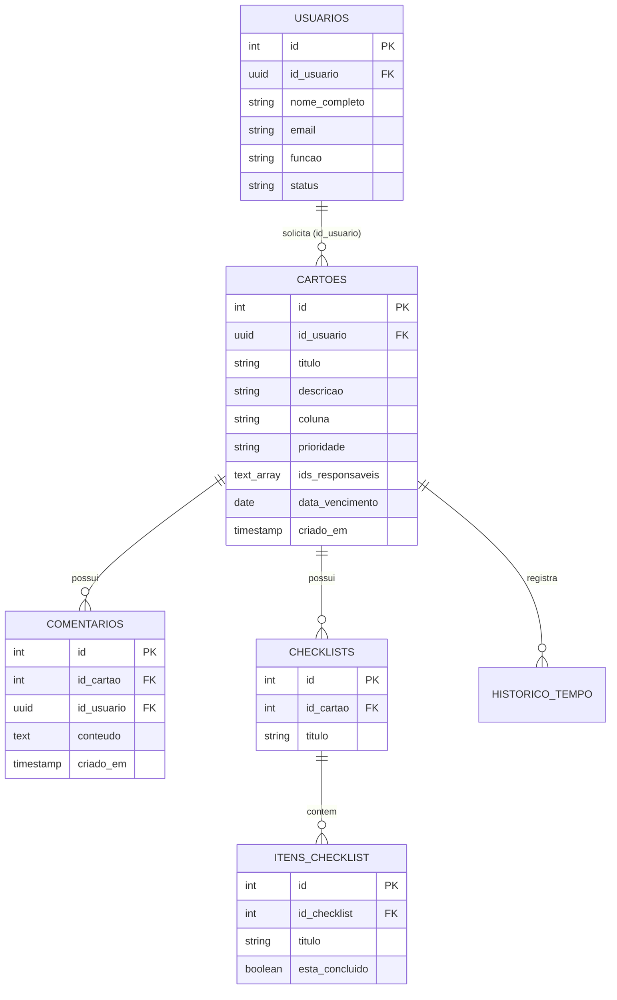

# SGDI - Sistema de Gestão de Demandas de TI

> Plataforma completa e moderna para gerenciamento, rastreamento e governança de demandas, tarefas e projetos de equipes de Tecnologia da Informação.

---

## 📌 Visão Geral

O **SGDI** (Sistema de Gestão de Demandas de TI) foi projetado para elevar a produtividade e a rastreabilidade operacional de times de tecnologia. Com interface fluida, suporte a **Dark Mode**, fluxos ágeis em **Quadro Kanban**, visualização alternativa em **Lista / Tabela Paginada**, controle estrito de solicitantes, múltiplos responsáveis por demanda, checklists dinâmicos, apontamento de horas com cronômetro integrado e exportação de relatórios, o sistema atende desde o registro da demanda até a entrega final com total governança.

---

## 🚀 Tecnologias e Arquitetura

### Front-end
- **React 18** (com **TypeScript** em modo estrito)
- **Vite** (Build tool e servidor de desenvolvimento de alta velocidade)
- **React Router DOM v6** (Roteamento SPA com rotas protegidas e divisão de bundle)
- **CSS Padrão W3C & CSS Variables** (Design System 100% nativo, sem compiladores externos, com Dark/Light Mode e tokens semânticos)
- **Radix UI** (Primitivos de acessibilidade: Diálogos, Menus Suspensos, Popovers, Comandos e Alertas)
- **@dnd-kit** (`@dnd-kit/core`, `@dnd-kit/sortable`, `@dnd-kit/utilities`) (Arrastar e soltar suave no Kanban)
- **@tanstack/react-query v5** (Cache assíncrono, invalidação inteligente e sincronização em tempo real)
- **Tabler Icons & Lucide React** (Conjunto consistente de ícones vetoriais)
- **Date-fns** (Tratamento e formatação de datas internacionalizadas em `pt-BR`)
- **Sonner** (Notificações toast modernas e não obstrutivas)

### Arquitetura de Estilização (100% CSS Nativo)
- **Zero Dependência de Tailwind CSS**: O sistema opera integralmente sobre a especificação **W3C Standard CSS**, sem dependência de compiladores, pré-processadores ou plugins de build do Tailwind.
- **Design System Modular**: Tokens globais de design (`:root` e `.dark` com variáveis OKLCH de alto contraste e acessibilidade), classes semânticas padronizadas (`.sgdi-*`) e arquivos `.css` modulares organizados por componente.
- **Performance de Build**: Pipeline otimizada diretamente pelo Vite, com suporte nativo a temas Claro/Escuro, microinterações e transições fluidas.

### Back-end & Banco de Dados
- **Supabase**
  - **PostgreSQL**: Banco de dados relacional robusto com IDs sequenciais humanizados (`#1`, `#2`...)
  - **Supabase Auth**: Autenticação segura por e-mail/senha e login social OAuth (Google)
  - **Row Level Security (RLS)**: Políticas ativas de segurança por usuário e organização
  - **Triggers e Funções SQL**: Sincronização automática entre `auth.users` e tabela unificada de `usuarios`

### Testes Automatizados
- **Vitest**: Suíte de testes unitários cobrindo regras de negócio, ordenação por urgência, filtros combinados, cálculo de demandas por solicitante e lógica de paginação.

---

## 🎯 Funcionalidades do Sistema

### 1. Governança de Demandas & Sprints
- **Classificação por Urgência / Prioridade**: Níveis **Alta** (🔴 Urgente), **Média** (🟡) e **Baixa** (🟢), com ordenação dinâmica que posiciona automaticamente as demandas prioritárias no topo.
- **Controle Estrito de Solicitantes**: Substituição total de texto livre por vínculo com usuários cadastrados na base, permitindo rastrear o autor, exibir data/hora de criação no cartão (`Criado por [Nome] • dd/MM/yyyy às HH:mm`) e monitorar a quantidade de demandas abertas por usuário.
- **Múltiplos Responsáveis**: Atribuição de um ou mais membros por tarefa, com exibição de avatares empilhados.
- **Gestão de Prazos e Vencimentos**: Seletor de data de entrega com alertas visuais inteligentes (*No Prazo*, *Vence Hoje*, *Atrasado*). Apenas o solicitante ou responsáveis possuem permissão para renegociar prazos.
- **Checklists e Critérios de Aceite**: Criação de listas de verificação com barra de progresso percentual e cálculo em tempo real de itens concluídos.
- **Cronômetro e Apontamento de Horas**: Rastreamento de tempo gasto na execução da demanda com suporte a início, pausa justificada (com registro de motivo) e histórico acumulado.

### 2. Consultas Avançadas & Navegação
- **Busca Global**: Localização instantânea por ID numérico (ex: `12` ou `#12`), termos do título ou conteúdo da descrição.
- **Filtros Combinados em Tempo Real**:
  - Filtro por **Status** (`Todos`, `📋 A Fazer`, `⚡ Em Andamento`, `✅ Concluído`).
  - Filtro por **Prioridade** (`Todas`, `🔴 Alta`, `🟡 Média`, `🟢 Baixa`).
  - Filtro por **Solicitante** (com contador de demandas abertas por usuário).
  - Filtro por **Responsável** (membro específico, não atribuídos ou todos).
  - Botão de **Limpeza Rápida** de filtros ativos.
- **Modos de Visualização Alternáveis**:
  - **Visualização em Quadro (Kanban)**: 3 colunas ágeis com arrastar-e-soltar, personalização de cores por coluna e paginação interna de 10 em 10 itens por status.
  - **Visualização em Lista / Tabela Paginada**: Tabela corporativa completa com cabeçalhos ordenáveis, navegação por páginas (Primeira, Anterior, Próxima, Última) e indicador de registros (`1 a 10 de N demandas`).
- **Exportação de Relatórios**: Exportação em um clique para **CSV** formatado (compatível com Excel) contendo ID, Título, Descrição, Status, Prioridade, Solicitante, Responsáveis, Vencimento, Data de Criação, Progresso de Checklists e Tempo Gasto.

### 3. Gestão de Equipe & Segurança
- **Tabela Única de Usuários**: Estrutura unificada de perfis e membros, com controle de função (Administrador / Membro).
- **Gestão de Convites**: Envio de convites por e-mail, alteração de privilégios e revogação de acessos.
- **Configurações Pessoais**: Edição de perfil, alteração de senha e alternância de temas (Claro, Escuro ou Automático).

---

## 📂 Estrutura de Diretórios

```text
Sistema_SGDI/
├── public/                     # Favicon e ativos públicos estáticos
├── src/
│   ├── componentes/            # Componentes reutilizáveis
│   │   ├── base/               # Botões, Badges, Distintivos
│   │   └── ui/                 # Componentes headless (Radix UI) e primitivos
│   ├── dados/                  # Definições de tipos, enums e dados de fallback
│   │   └── dados-iniciais.ts
│   ├── integracoes/            # Conexões externas
│   │   └── supabase/           # Cliente Supabase tipado
│   ├── lib/                    # Camada de lógica e contexto
│   │   ├── autenticacao/       # AuthProvider, hooks de sessão e login
│   │   ├── provedor-dados/     # Hooks do React Query (cartões, usuários, comentários)
│   │   └── utilitarios.ts      # Utilitários de classes CSS (cn/clsx)
│   ├── paginas/                # Páginas da aplicação (SPA)
│   │   ├── autenticacao/       # Telas de Login, Cadastro e Retorno OAuth
│   │   ├── configuracoes/      # Perfil, Senha e Gestão de Membros da Equipe
│   │   ├── quadro/             # Gestão de Demandas
│   │   │   └── componentes/    # Quadro Kanban, Tabela paginada, Barra de ferramentas,
│   │   │                       # Cronômetro, Checklists e Detalhes do Cartão
│   │   └── nao-encontrado.tsx  # Tratamento de rota 404
│   ├── App.test.tsx            # Suíte de testes automatizados com Vitest
│   ├── App.tsx                 # Rotas e provedores da aplicação
│   ├── estilos/                # Sistema de Design consolidado em CSS W3C nativo
│   ├── index.css               # Design tokens, variáveis CSS globais e resets nativos
│   └── main.tsx                # Bootstrap da aplicação React
├── supabase/
│   └── migrations/             # Scripts SQL de schema, RLS e migrações
├── package.json                # Dependências e scripts de execução
├── tsconfig.json               # Configurações do TypeScript
└── vite.config.ts              # Configurações do Vite e plugins
```

---

## 🗄️ Modelo de Dados (Supabase / PostgreSQL)

O banco de dados foi estruturado com chaves primárias numéricas sequenciais (`SERIAL / INT`) para legibilidade e índices otimizados para busca e filtragem:



---

## 🛠️ Instalação e Execução Local

### Pré-requisitos
- **Node.js** (versão 18.x ou superior)
- Gerenciador de pacotes **npm**, **pnpm** ou **yarn**
- Uma instância ativa do **Supabase** (projeto Cloud ou local)

### 1. Clonar o projeto e instalar as dependências
```bash
git clone <URL_DO_REPOSITORIO>
cd Sistema_SGDI
npm install
```

### 2. Configurar as Variáveis de Ambiente
Crie um arquivo `.env` na raiz do projeto com as chaves do seu projeto Supabase:
```env
VITE_SUPABASE_URL=https://seu-projeto.supabase.co
VITE_SUPABASE_ANON_KEY=sua-chave-publica-anonima-aqui
```

### 3. Aplicar as Migrações no Banco de Dados
Execute os scripts presentes na pasta `supabase/migrations/` no SQL Editor do seu painel Supabase (em especial `20260924_tabela_unica_usuarios.sql`).

### 4. Iniciar o Ambiente de Desenvolvimento
```bash
npm run dev
```
Acesse a aplicação no navegador em `http://localhost:8080` (ou na porta indicada pelo Vite).

---

## 🧪 Executando os Testes Automatizados

A aplicação possui testes unitários implementados com **Vitest** para garantir a integridade das regras de negócio:

```bash
# Executa a suíte de testes completa
npm test

# Executa os testes em modo contínuo (watch)
npm test -- --watch
```

---

## 📦 Scripts Disponíveis

| Comando | Descrição |
| :--- | :--- |
| `npm run dev` | Inicia o servidor local de desenvolvimento com Hot Module Replacement (HMR). |
| `npm run build` | Compila o código TypeScript e gera o bundle minificado para produção em `/dist`. |
| `npm run preview` | Executa localmente o servidor com a build de produção compilada. |
| `npm test` | Roda a suíte de testes unitários com o Vitest. |

---

## 📄 Licença

Este projeto é desenvolvido para fins corporativos e acadêmicos de Gestão de Demandas de TI. Distribuído sob a licença **MIT**.
