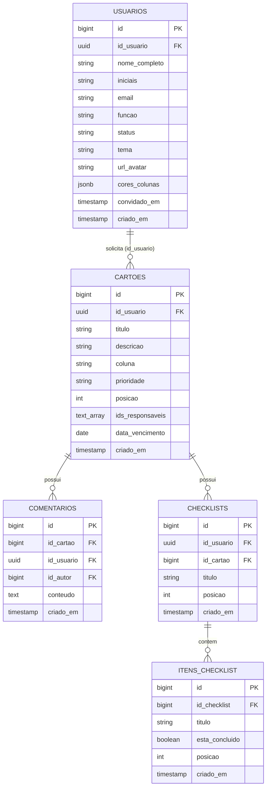

# SGDI - Sistema de Gestão de Demandas de TI

> Plataforma completa e moderna para gerenciamento, rastreamento e governança de demandas, tarefas e projetos de equipes de Tecnologia da Informação.

---

## 📌 Visão Geral

O **SGDI** (Sistema de Gestão de Demandas de TI) foi projetado para elevar a produtividade, a rastreabilidade operacional e a governança de times ágeis de tecnologia. 

Com interface fluida e suporte a **Dark Mode**, o sistema oferece:
- **Fluxos Ágeis em Quadro Kanban** com arrastar-e-soltar, paginação interna, colapso/expansão de colunas e customização de cores (com preto absoluto padrão no modo escuro);
- **Visualização em Tabela Corporativa Paginada** (10 em 10 itens) para leitura gerencial densa e auditável;
- **Apontamento de Horas com Cronômetro Inteligente**, suporte a estimativas por **Nível de Complexidade**, pausas com motivos estruturados, regra estrita de permissão por responsável e log automático de conclusão;
- **Controle Estrito de Solicitantes e Múltiplos Responsáveis**, eliminando campos livres e garantindo integridade de vínculos;
- **Exportação Dupla de Relatórios**: planilha em **CSV formatado** (compatível com Excel) e **Relatório Corporativo para Impressão / PDF** em layout A4 estilizado;
- **Arquitetura Híbrida e Resiliente**, unindo banco relacional PostgreSQL com Row Level Security (Supabase) a uma camada *offline-first* para metadados de produtividade.

---

## 🚀 Tecnologias e Arquitetura

### Front-end
- **React 18** (com **TypeScript** em modo estrito)
- **Vite** (Build tool e servidor de desenvolvimento ultrarrápido com HMR)
- **React Router DOM v6** (Roteamento SPA com rotas protegidas e divisão de bundle via `lazy`/`Suspense`)
- **CSS Padrão W3C & CSS Variables** (Design System nativo, sem compiladores externos, com Dark/Light Mode e tokens OKLCH)
- **Radix UI** (Primitivos headless de acessibilidade: Diálogos, Menus Suspensos, Popovers, Comandos e Alertas)
- **@dnd-kit** (`@dnd-kit/core`, `@dnd-kit/sortable`, `@dnd-kit/utilities`) (Arrastar e soltar suave no Kanban)
- **@tanstack/react-query v5** (Cache assíncrono, invalidação inteligente e sincronização de dados)
- **@tanstack/react-table** (Estruturação e manipulação eficiente de dados tabulares)
- **Tabler Icons & Lucide React** (Conjuntos de ícones vetoriais modernos)
- **Date-fns** (Tratamento e formatação internacionalizada de datas em `pt-BR`)
- **Sonner** (Notificações toast modernas e não obstrutivas)

### Arquitetura de Estilização (100% CSS Nativo)
- **Zero Dependência de Compilação Tailwind CSS**: O sistema opera integralmente sobre a especificação **W3C Standard CSS**, sem dependência de CLI ou plugins de compilação do Tailwind.
- **Design System Modular**: Tokens globais de design (`:root` e `.dark` com variáveis OKLCH de alto contraste e acessibilidade), classes semânticas padronizadas (`.sgdi-*`) e arquivos `.css` modulares organizados por componente.
- **Suporte Nativo a Temas**: Alternância instantânea entre modo Claro (Light), Escuro (Dark) e Automático (System).

### Back-end & Persistência de Dados
- **Supabase (PostgreSQL)**
  - Banco de dados relacional com IDs sequenciais legíveis (`#1`, `#2`...) para cartões, usuários, comentários e checklists.
  - **Supabase Auth**: Autenticação segura por e-mail/senha e login social OAuth (Google).
  - **Row Level Security (RLS)**: Políticas ativas de segurança por usuário autenticado.
  - **Triggers e Funções SQL**: Sincronização automática entre `auth.users` e tabela unificada de `usuarios`.
- **Arquitetura Híbrida / Offline-First (LocalStorage)**
  - Camada de alta performance e resiliência local para metadados de produtividade:
    - Estado do cronômetro ativo, sessões acumuladas e pausas categorizadas (`supabase-card-metadata-v1`);
    - Preferências de cores personalizadas das colunas do quadro (`sgdi-cores-colunas-v1`);
    - Fallback de integridade e ordenação local para checklists (`supabase-card-checklists-v1`).

### Testes Automatizados
- **Vitest**: Suíte de testes unitários (23 testes automatizados) cobrindo regras de negócio, ordenação por urgência/prioridade, filtros combinados de solicitante e responsável restritos a dados reais, ciclo de vida e exclusão de cartões com limpeza em cascata, paginação em blocos de 10 e configuração/persistência de cores com fallback seguro.

---

## 🎯 Funcionalidades do Sistema

### 1. Governança de Demandas & Sprints
- **Classificação por Urgência / Prioridade**: Níveis **Alta** (🔴 Urgente), **Média** (🟡) e **Baixa** (🟢), com ordenação dinâmica que posiciona automaticamente as demandas prioritárias no topo.
- **Níveis de Complexidade & Estimativa de Tempo**: Cada demanda pode receber uma estimativa de complexidade com cálculo padrão de horas:
  - **Baixa**: 2h estimadas
  - **Média**: 4h estimadas
  - **Alta**: 8h estimadas
  - **Muito Alta**: 16h estimadas
  - Permite avaliar visualmente o **Tempo Estimado vs. Tempo Real Gasto**.
- **Controle Estrito de Solicitantes**: Substituição total de texto livre por vínculo relacional com usuários cadastrados na base. Exibe data/hora de criação no cartão (`Criado por [Nome] • dd/MM/yyyy às HH:mm`) e monitora a quantidade de demandas abertas por usuário.
- **Múltiplos Responsáveis**: Atribuição flexível de um ou mais membros por tarefa, com exibição de avatares empilhados.
- **Gestão de Prazos e Vencimentos**: Seletor de data de entrega com alertas visuais inteligentes (*No Prazo*, *Vence Hoje*, *Atrasado*). Apenas o solicitante ou responsáveis possuem permissão para renegociar prazos.
- **Checklists e Critérios de Aceite**: Criação de listas de verificação com barra de progresso percentual e cálculo em tempo real de itens concluídos.
- **Cronômetro e Apontamento de Horas Avançado**:
  - **Permissão por Responsável**: Apenas os membros formalmente atribuídos como responsáveis pela demanda têm permissão para iniciar o cronômetro (com bloqueio visual e tooltip explicativo para os demais).
  - **Widget Visual no Cartão**: Indicador compacto com efeito pulsante durante execução e badge visual de tarefa concluída.
  - **Modal de Pausa com Motivos Categorizados**: Pausa rápida com seleção de motivos padronizados (*Intervalo de Almoço*, *Alinhamento Técnico em Call*, *Janela de Manutenção*, *Aguardando Liberação Externa/Credenciais*) ou justificativa personalizada.
  - **Finalização Automática e Auditoria**: Ao mover o cartão para a coluna **Concluído**, o cronômetro é finalizado automaticamente e um registro de auditoria é gravado no log com data/hora exata (`dd/MM/yyyy às HH:mm:ss`) e o usuário que concluiu a demanda.

---

### 2. Consultas Avançadas, Navegação & Modos de Visualização

- **Busca Global**: Localização instantânea por ID numérico (ex: `12` ou `#12`), termos do título ou conteúdo da descrição.
- **Filtros Combinados Inteligentes em Tempo Real**:
  - Filtro por **Status** (`Todos`, `📋 A Fazer`, `⚡ Em Andamento`, `✅ Concluído`).
  - Filtro por **Prioridade** (`Todas`, `🔴 Alta`, `🟡 Média`, `🟢 Baixa`).
  - Filtro por **Solicitante**: Lista dinamicamente apenas os usuários que criaram cartões na base, exibindo contador de tarefas.
  - Filtro por **Responsável**: Lista apenas membros com demandas ativas atribuídas, opção para tarefas *Não Atribuídas* e *Todos*.
  - Botão de **Limpeza Rápida** de filtros ativos.
- **Ordenação Dinâmica Flexível**: Ordenação manual, por Prioridade/Urgência, Data de Vencimento, Responsável, Título e Data de Criação.

#### Modos de Visualização Alternáveis
- **Visualização em Quadro (Kanban)**:
  - 3 colunas ágeis (`A Fazer`, `Em Andamento`, `Concluído`) com arrastar-e-soltar fluido.
  - **Personalização de Cores das Colunas**: Paleta com **16 cores sólidas/flat** (azul, verde, roxo, âmbar, vermelho, rosa, índigo, teal, etc.), com **preto absoluto (`#000000`)** padrão de fábrica no Modo Escuro (Dark Mode) para máxima imersão. As configurações de cores são salvas no cache do navegador (`localStorage`) por usuário.
  - **Recolhimento e Expansão de Colunas**: Botões para colapsar/expandir individualmente ou em lote (*"Recolher todas"* e *"Expandir todas"*), otimizando o espaço útil de tela.
  - **Paginação Interna por Coluna**: Navegação de 10 em 10 cartões por status para máxima performance em colunas com alto volume de tarefas.
- **Visualização em Tabela / Lista Paginada**:
  - Tabela corporativa completa com identificador sequencial `#ID`, Demanda, Status com ícone, Prioridade colorida, Solicitante, Avatares dos Responsáveis e Prazo.
  - Navegação paginada completa (Primeira, Anterior, Próxima, Última) e contador de registros (`1 a 10 de N demandas`).
  - Acesso direto aos detalhes e edição do cartão.

---

### 3. Exportação de Relatórios Corporativos

A aplicação disponibiliza dois formatos nativos de exportação na barra de ferramentas:

1. **Exportação para Planilha (CSV)**:
   - Arquivo `.csv` gerado em tempo real com codificação `UTF-8 BOM` (compatibilidade imediata com Microsoft Excel sem erros de acentuação).
   - Contém: ID, Título, Descrição, Coluna/Status, Prioridade, Solicitante, Responsáveis, Data de Vencimento, Data de Criação, Progresso dos Checklists e Tempo Total Gasto.
2. **Relatório Corporativo para Impressão / PDF**:
   - Layout formal e estilizado pronto para emissão via `window.print()` (ou salvar como PDF).
   - Cabeçalho executivo institucional, timestamp de geração (`dd/MM/yyyy às HH:mm:ss`), resumo quantitativo de tarefas por status e tabela de demandas no padrão corporativo em orientação A4/Paisagem.

---

### 4. Gestão de Equipe & Segurança

- **Tabela Única de Usuários**: Estrutura unificada de perfis e membros, com controle de função (Administrador / Membro).
- **Gestão de Convites**: Envio de convites por e-mail, alteração de privilégios e revogação de acessos.
- **Configurações Pessoais**: Edição de perfil, alteração de senha e alternância de temas (Claro, Escuro ou Automático).

---

## 📂 Estrutura de Diretórios

```text
Sistema_SGDI/
├── public/                     # Favicon e ativos públicos estáticos
├── src/
│   ├── componentes/            # Componentes reutilizáveis
│   │   ├── base/               # Botões, Badges, Distintivos estilizados
│   │   └── ui/                 # Componentes headless (Radix UI) e primitivos
│   ├── tipos/                  # Tipos de domínio, enums e configurações do quadro
│   │   └── quadro.ts           # Definições de Cartões, Colunas, Prioridades e Complexidade
│   ├── integracoes/            # Conexões externas
│   │   └── supabase/           # Cliente Supabase tipado e helpers de conexão
│   ├── lib/                    # Camada de lógica e contexto
│   │   ├── autenticacao/       # AuthProvider, hooks de sessão, login e recuperação
│   │   ├── provedor-dados/     # Hooks do React Query (cartões, membros, comentários)
│   │   │   ├── hooks/          # use-cartoes, use-cronometro, use-comentarios
│   │   │   └── storage-local.ts# Camada de metadados locais (tempo, pausas e checklists)
│   │   └── utilitarios.ts      # Utilitários de classes CSS (cn/clsx)
│   ├── paginas/                # Páginas da aplicação (SPA)
│   │   ├── autenticacao/       # Telas de Login, Cadastro e Retorno OAuth
│   │   ├── configuracoes/      # Perfil, Senha e Gestão de Membros da Equipe
│   │   ├── quadro/             # Gestão de Demandas
│   │   │   ├── componentes/    # Quadro Kanban, Tabela de Demandas, Barra de Ferramentas,
│   │   │   │   ├── cronometro/ # Widget de Cronômetro (compacto e detalhado)
│   │   │   │   └── ...         # Modais, Checklists, Seletor de Cores e Detalhes
│   │   └── nao-encontrado.tsx  # Tratamento de rota 404
│   ├── App.test.tsx            # Suíte de 23 testes unitários com Vitest
│   ├── App.tsx                 # Rotas da aplicação, Suspense e Provedor de Dados
│   ├── estilos/                # Sistema de Design consolidado em CSS W3C nativo
│   ├── index.css               # Design tokens, variáveis CSS globais e resets nativos
│   └── main.tsx                # Bootstrap da aplicação React
├── supabase/
│   └── migrations/             # Scripts SQL de schema, RLS e migrações
├── package.json                # Dependências e scripts de execução
├── tsconfig.json               # Configurações do TypeScript
└── vite.config.ts              # Configurações do Vite e plugins
```

---

## 🗄️ Modelo de Dados (Supabase / PostgreSQL)

O banco de dados relacional foi estruturado com chaves primárias sequenciais humanizadas (`BIGSERIAL / INT`) para legibilidade e índices otimizados para busca e filtragem:


```mermaid
erDiagram
    USUARIOS ||--o{ CARTOES : "solicita (id_usuario)"
    CARTOES ||--o{ COMENTARIOS : "possui"
    CARTOES ||--o{ CHECKLISTS : "possui"
    CHECKLISTS ||--o{ ITENS_CHECKLIST : "contem"

    USUARIOS {
        bigint id PK
        uuid id_usuario FK
        string nome_completo
        string iniciais
        string email
        string funcao
        string status
        string tema
        string url_avatar
        jsonb cores_colunas
        timestamp convidado_em
        timestamp criado_em
    }

    CARTOES {
        bigint id PK
        uuid id_usuario FK
        string titulo
        string descricao
        string coluna
        string prioridade
        int posicao
        text_array ids_responsaveis
        date data_vencimento
        timestamp criado_em
    }

    CHECKLISTS {
        bigint id PK
        uuid id_usuario FK
        bigint id_cartao FK
        string titulo
        int posicao
        timestamp criado_em
    }

    ITENS_CHECKLIST {
        bigint id PK
        bigint id_checklist FK
        string titulo
        boolean esta_concluido
        int posicao
        timestamp criado_em
    }

    COMENTARIOS {
        bigint id PK
        bigint id_cartao FK
        uuid id_usuario FK
        bigint id_autor FK
        text conteudo
        timestamp criado_em
    }
```

> [!NOTE]
> **Persistência de Metadados de Produtividade**: As sessões de tempo ativo, o histórico acumulado de pausas categorizadas e a estimativa de complexidade das tarefas são gerenciados de forma resiliente na camada de aplicação via `localStorage` (`supabase-card-metadata-v1`), com sincronização instantânea no cache do React Query e desacoplamento do ciclo de vida das tabelas relacionais básicas.

---

## 🛠️ Instalação e Execução Local

### Pré-requisitos
- **Node.js** (versão 18.x ou superior)
- Gerenciador de pacotes **npm**, **pnpm** ou **yarn**
- Uma instância ativa do **Supabase** (projeto Cloud ou local)

### 1. Clonar o projeto e instalar as dependências
```bash
git clone <URL_DO_REPOSITORIO>
cd Sistema_SGDI
npm install
```

### 2. Configurar as Variáveis de Ambiente
Crie um arquivo `.env` na raiz do projeto com as chaves do seu projeto Supabase:
```env
VITE_SUPABASE_URL=https://seu-projeto.supabase.co
VITE_SUPABASE_ANON_KEY=sua-chave-publica-anonima-aqui
```

### 3. Aplicar as Migrações no Banco de Dados
Execute os scripts presentes na pasta `supabase/migrations/` no SQL Editor do seu painel Supabase:
1. `20260924_tabela_unica_usuarios.sql` (Estrutura principal: usuários, cartões, comentários, checklists e RLS)
2. `20260929_cores_colunas_usuario.sql` (Adiciona coluna `cores_colunas` na tabela de usuários)

### 4. Iniciar o Ambiente de Desenvolvimento
```bash
npm run dev
```
Acesse a aplicação no navegador em `http://localhost:8080` (porta padrão configurada no Vite).

---

## 🧪 Executando os Testes Automatizados

A aplicação possui **23 testes unitários** implementados com **Vitest** cobrindo regras de negócio, ordenação por urgência, filtros avançados, cálculo de demandas por solicitante, paginação e persistência de cores:

```bash
# Executa a suíte completa de testes unitários
npm test

# Executa os testes em modo contínuo interativo (watch)
npm run test:watch
```

---

## 📦 Scripts Disponíveis

| Comando | Descrição |
| :--- | :--- |
| `npm run dev` | Inicia o servidor local de desenvolvimento com Hot Module Replacement (HMR) na porta 8080. |
| `npm run build` | Compila o código TypeScript e gera o bundle de produção otimizado em `/dist`. |
| `npm run build:dev` | Compila a aplicação em modo de desenvolvimento. |
| `npm run preview` | Executa localmente o servidor para visualização da build de produção compilada. |
| `npm test` | Executa a suíte completa de testes unitários com o Vitest (`vitest run`). |
| `npm run test:watch` | Executa os testes unitários em modo interativo de monitoramento contínuo. |
| `npm run lint` | Executa a verificação estática de código com o ESLint. |

---

## 📄 Licença

Este projeto é desenvolvido para fins corporativos e acadêmicos de Gestão de Demandas de TI. Distribuído sob a licença **MIT**.
